# Operational Demand Reversal in the Australian National Electricity Market (NEM), 2022–2026


Quantifying how rooftop solar has flipped the NEM from max-demand-constrained to **min-demand-constrained** across all 5 regions over 44 months.

Pipeline: AEMO NEMWeb CURRENT + Open-Meteo Archive → AWS S3 (raw zip + parsed parquet) → Snowpipe → Snowflake → dbt → predict.py inference → Streamlit Community Cloud public dashboard. Postgres + Power BI are retained for the original retrospective analysis layer.

---

## Why this matters

Australia's grid was historically sized around the evening peak. The 6–8 pm winter maximum drove capacity planning, operating reserves, ramping reserves, and inter-regional flow design.

Behind-the-meter rooftop PV, now installed on roughly one in three Australian homes, has shifted that constraint to the other end of the daily load curve. In South Australia, **92 % of trading days** now have their minimum operational demand land between 10 am and 3 pm rather than pre-dawn.

Curtailment of grid-scale renewables, negative spot prices, and AEMO's minimum-demand security limits are symptoms of the same regime shift. Measuring how fast and how unevenly it is propagating across the five NEM regions matters for any planning question still calibrated against the old peak-constrained system.

---

## Problem Statement

Three pre-registered questions about NEM demand behaviour from August 2022 to March 2026:

- Is the daily-minimum operational demand systematically landing at midday rather than pre-dawn, and where is that pattern most established?
- Is the pattern consistent with a behind-the-meter rooftop PV mechanism, or are rooftop generation and demand reversal merely both trending upward over time?
- Are weather drivers of midday demand decoupled from drivers of peak demand, and can next-day reversal be forecast from end-of-today information?

---

## Executive Summary

- South Australia is already in a minimum-demand regime: **92 %** of trading days have their daily-minimum operational demand between 10 am and 3 pm.
- Rooftop-PV flow is the strongest explanatory variable for reversal magnitude in all four behind-the-meter-solar mainland regions, after trend and seasonality are removed (Newey-West HAC OLS, p ≤ 0.007).
- Tasmania's reversal frequency climbed similarly, but three independent tests isolate hydro dispatch — not rooftop PV — as the underlying mechanism.

---

## Key Findings

Pre-registered hypothesis verdicts are in [`docs/METHODOLOGY.md`](docs/METHODOLOGY.md). Eight findings below; numbers and figures are from the production run.

**1. South Australia has fully saturated on frequency, and is still deepening on magnitude.**
SA reversal frequency = **92 % of trading days** (std 7 pp across 44 months — already a regime, not isolated events). The frequency leg has hit its ceiling, but the deepest December monthly minimum keeps dropping: +120 MW (Dec 2022) → **−311 MW (Dec 2025)**. The two halves of the story have decoupled.

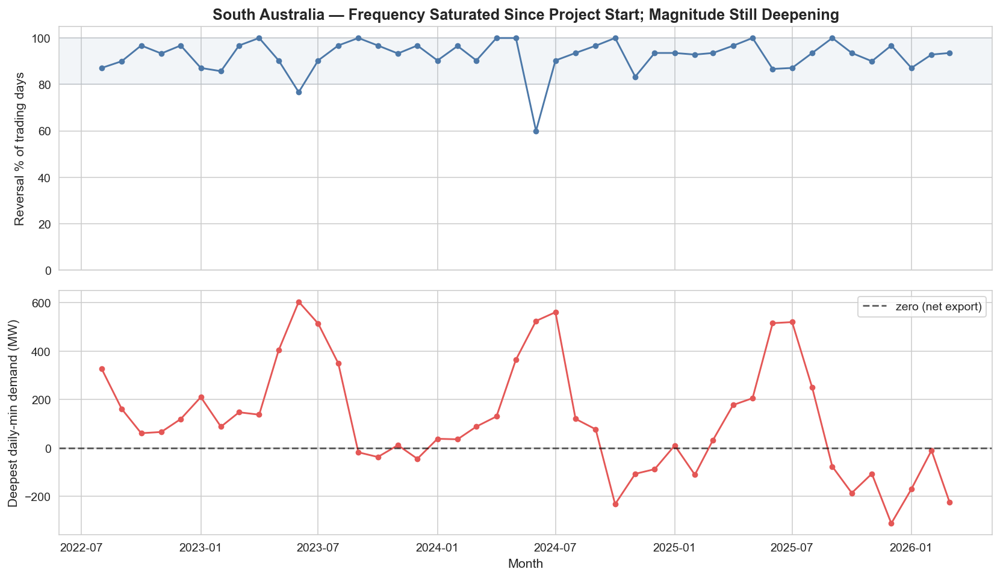

**2. The pre-dawn / midday demand gap is widening in every region.**
Trend-controlled OLS on monthly `gap = h03_mean − h13_mean` per region, all five regions p < 10⁻⁴. SA = **+90 MW / year**, VIC = +186, NSW = +237, QLD = +151, TAS = +19. Caveat: SA's hour-03 baseline drifted +7 % over the same window, so some of the widening reflects a higher baseline rather than purely a deeper midday trough — reported as a methodological caveat, not a contradiction of the finding.

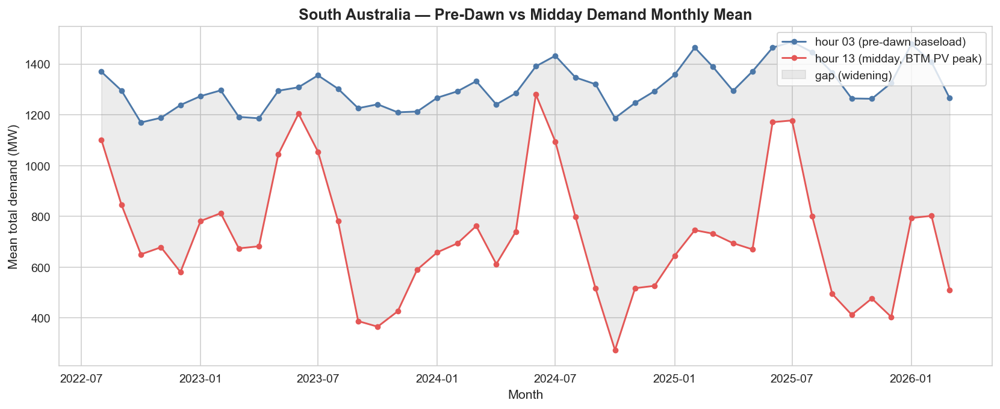

**3. Cross-region order tracks BTM-solar penetration, with Tasmania flagged as a hydro outlier from the start.**
Reversal frequency: SA 92 % / QLD 71 % / VIC 58 % / NSW 56 % — monotone in the expected penetration ordering. TAS climbed from 16 % to 74 % across the window but on a different mechanism (see Cross-validating findings).

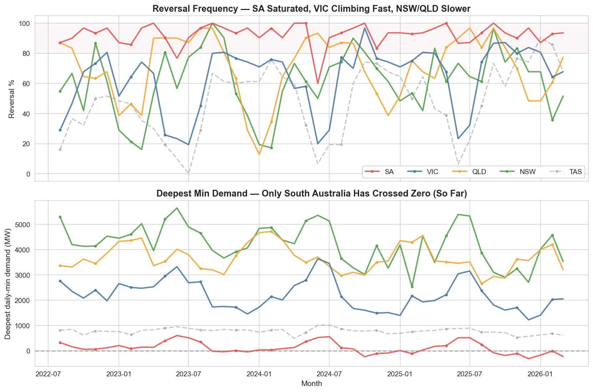

**4. Rooftop-PV flow explains reversal magnitude in every BTM-solar region, after trend and seasonality are controlled for.**
Per-region OLS `deepest_min_demand ~ p95_rooftop_mw + time_idx + C(calendar_month)` with Newey-West HAC standard errors (maxlags = 6) absorbs trend and autocorrelation so the rooftop coefficient is identified by month-to-month flow variation. SA β = **−0.34** (p = 0.007), VIC −1.20 (3×10⁻⁵), NSW −1.00 (1×10⁻⁴), QLD −0.63 (0.003); Tasmania sign-flips to **β = +0.77 (p = 0.48)** — first independent flag that TAS reversal is not consistent with a BTM-PV mechanism.

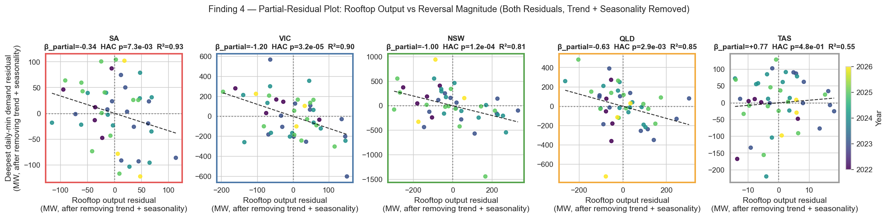

**5. Weekend amplifies reversal frequency in VIC and NSW.**
Weekend reversal-rate lift of **+19 pp in VIC, +19 pp in NSW** (chi-square p < 10⁻¹⁰). The behavioural channel (industrial / commercial midday load missing on weekends) shows up cleanly in mainland mid-penetration regions. SA shows no lift because weekday frequency is already saturated at 92 %; QLD is non-significant.

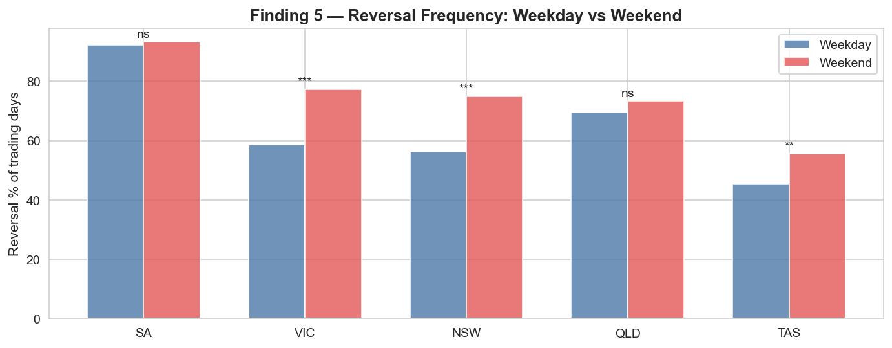

**6. Weather drivers of min and max demand are *shared*, not decoupled — but weather explains min demand more reliably.**
Pre-registered H4b (driver decoupling) rejected in 0 of 5 regions: solar radiation is the strongest negatively-signed predictor of both daily extremes. Fallback H4' confirms instead — R²_min > R²_max in 4 of 5 regions, with material gaps (SA Δ = +0.30, VIC +0.17, NSW +0.19, QLD +0.28), consistent with `weather → BTM-PV → min-demand` being a tighter physical chain than `weather → air-conditioning behaviour → max-demand`. Tasmania is the only flip — second independent TAS flag.

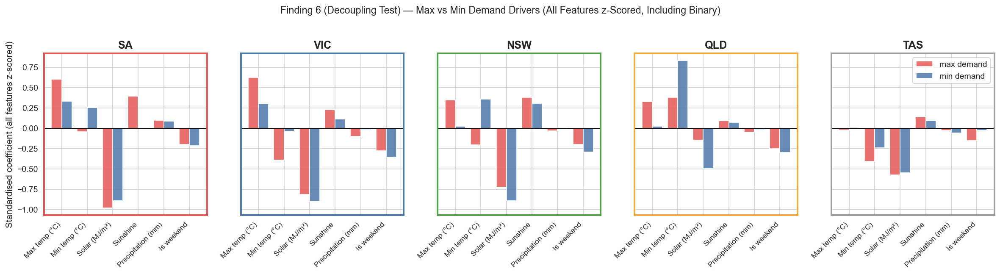

**7. Reversal days and negative-pricing days co-occur tightly in BTM-solar regions.**
Per-region Fisher conditional odds ratio for `is_reversal_day × had_negative_RRP_today`. VIC OR = **4.78**, NSW 5.26, QLD 5.64 (all p < 10⁻²⁵). SA OR = 2.75 is muted by saturation (73 % of SA's non-reversal days already carry negative pricing — no headroom). Tasmania OR = 0.99 with a CI straddling 1.0 — third independent TAS flag.

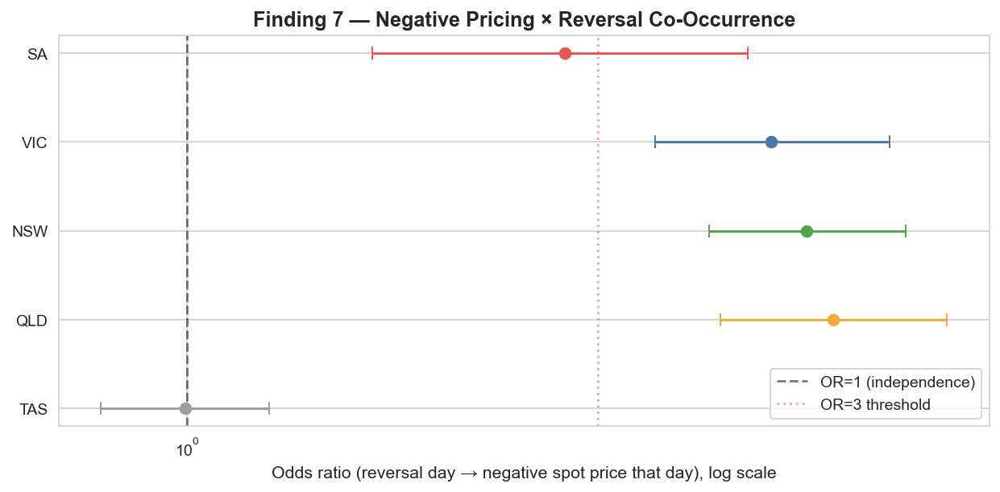

**8. Tomorrow's reversal is predictable from today's information, but only modestly.**
VIC 24h-ahead classifier across three tracks: persistence baseline AUC = **0.631** → leak-free LR AUC = **0.755** (lift +0.124 ✓) → forecast-proxy RF with same-day weather AUC = **0.923** (ceiling, not deployable). Lift over persistence passes the pre-registered bar; the absolute AUC ≥ 0.80 bar misses, so the result is reported as a modest production signal rather than publication-grade.

<table>
<tr>
<td>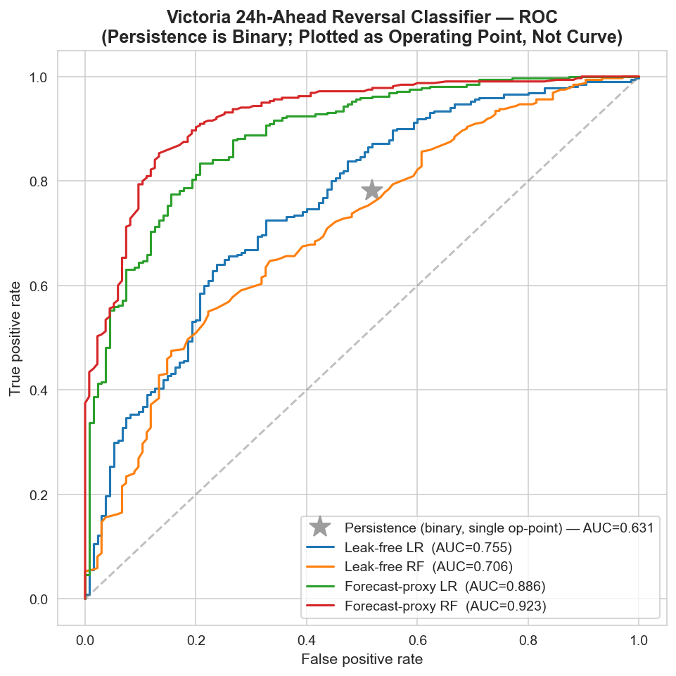</td>
<td>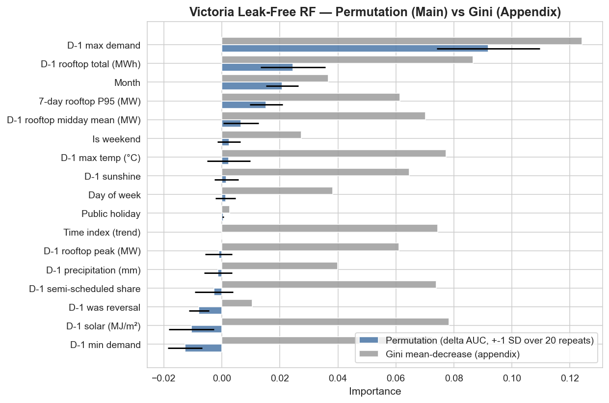</td>
</tr>
</table>

---

## Cross-validating findings

Three independent tests, three convergent conclusions. The strongest conclusions here are triangulated across independent specifications rather than resting on a single model.

- **Tasmania's reversal is hydro dispatch, not rooftop PV.** Finding 4 (rooftop coefficient sign-flips positive, p = 0.48), Finding 6 (R²_max > R²_min — opposite asymmetry to every other region), and Finding 7 (OR ≈ 1, CI straddles 1) all isolate TAS through entirely different statistical machinery. The convergence is what makes the conclusion defensible.
- **South Australia's saturation regime shows up as muted signal everywhere.** Finding 5 (no weekend lift — already saturated weekdays), Finding 7 (OR muted at 2.75 — no headroom), and the H1 / H5' split between frequency and magnitude all reflect the same underlying ceiling effect.
- **Shared weather drivers (H4b reject) support Findings 1, 2, and 4.** Solar-related weather variables are associated with lower demand at both daily extremes, not just the midday trough — so a single rooftop-PV channel is consistent with Findings 1, 2, and 4 without needing two separate mechanisms.

---

## Dashboard (Power BI)

Two-page interactive report. Page 1 has a region slicer that cross-filters its five hero charts; Page 2 is methodology + ML summary, not slicer-driven.

| Page | Focus |
|---|---|
| 1. Findings | 5 hero charts: SA dual-axis (Finding 1), 5-region trajectory (Finding 3), h03/h13 fan (Finding 2), rooftop magnitude scatter (Finding 4), odds-ratio forest (Finding 7) |
| 2. Methodology & ML | Partial-residual scatter (Finding 4 magnitude), 3 AUC KPI cards, ROC + RF permutation importance (Finding 8) |

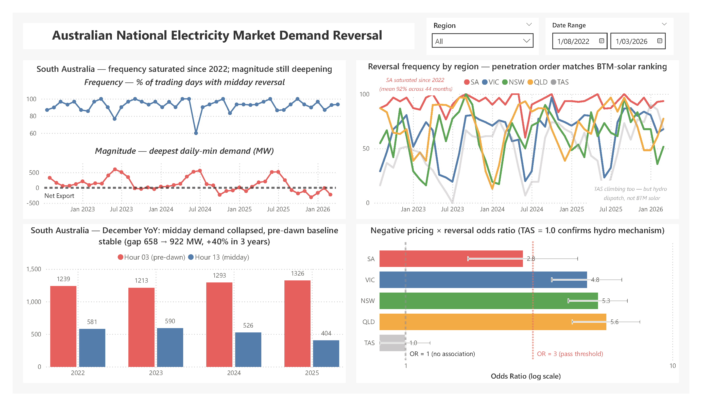

Page 2 is a methodology + ML walkthrough — the Finding 4 partial-residual scatter and the Finding 8 model benchmark consolidated into a single Power BI view. Open [`dashboard/nem_reversal.pbix`](dashboard/nem_reversal.pbix) to explore it interactively.

---

## Live pipeline

The retrospective findings above sit on top of a self-managing daily inference loop: NEMWeb CURRENT, AWS S3, Snowflake, Snowpipe, dbt, GitHub Actions, and Streamlit Community Cloud. The fitted leak-free LR pipeline is pickled once and reused — same model, same features, no nightly retraining. The analytics layer (raw → dbt views → features → predictions) refreshes nightly from the new day's NEMWeb data.

### Architecture

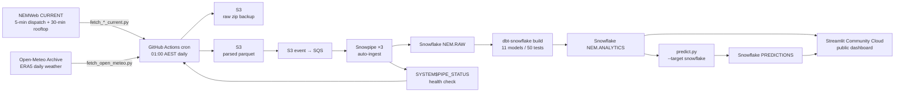

### Component map

| Layer | Stack |
|---|---|
| Ingest | NEMWeb CURRENT scraper (5-min dispatch + 30-min rooftop) + Open-Meteo Archive (daily weather) |
| Object storage | AWS S3 (raw zip backup + parsed parquet) |
| Warehouse | Snowflake (`NEM.RAW` + `NEM.ANALYTICS`); PostgreSQL retained as local dev SOT |
| Transformation | dbt with both `dbt-postgres` and `dbt-snowflake` adapters (11 models, 50 schema tests) |
| Ingestion trigger | Snowpipe auto-ingest via S3 event → SQS (~30 s lag) |
| Orchestration | GitHub Actions cron at 01:00 AEST + `workflow_dispatch` |
| Inference | `predict.py --target snowflake` in CI, `--target postgres` for local replay |
| Monitoring | `pipeline/check_pipe_status.py` (`SYSTEM$PIPE_STATUS`) blocks CI if any pipe is stale > 26 h |
| Dashboards | Power BI desktop file + Streamlit Community Cloud public URL |
| Auth | AWS OIDC (no long-lived CI keys) + Snowflake password (GitHub / Streamlit Cloud secrets) |

### Bit-identical model behaviour across DB targets

The pickled leak-free LR pipeline and feature contract are the single source of truth. The smoke test replays the full held-out window from notebook 02 through `predict.py` against both DB targets and asserts the realised AUC matches the pickled value to within 1e-6:

```
$ python pipeline/smoke_test_predict.py --target postgres
[smoke] AUC replay   = 0.754907
[smoke] AUC artefact = 0.754907
[smoke] |gap|        = 0.00e+00   tol=1e-06
[smoke] PASS

$ python pipeline/smoke_test_predict.py --target snowflake
[smoke] AUC replay   = 0.754907
[smoke] AUC artefact = 0.754907
[smoke] |gap|        = 0.00e+00   tol=1e-06
[smoke] PASS
```

Zero-bit drift, both targets. Postgres stays as the fast local dev SOT (no warehouse credits); Snowflake is the cloud production SOT.

### Historical backfill, row-level parity

The 2022-08 → 2026-05 window (1.97 M dispatch + 332 K rooftop + 6.98 K weather rows) was migrated from Postgres to Snowflake via `pipeline/backfill_to_snowflake.py` — 93 monthly parquet files (~120 MB total) dropped into S3 in 38 seconds, Snowpipe drained the queue in under 10 minutes, and per-source row counts match Postgres exactly:

| Source | Postgres | Snowflake | Match |
|---|---:|---:|:-:|
| `region_5min` | 1,977,135 | 1,977,135 | ✓ |
| `rooftop_pv_30min` | 332,710 | 332,710 | ✓ |
| `weather_daily` | 6,980 | 6,980 | ✓ |

### Cost

Snowflake + S3 + SQS + GitHub Actions running this pipeline cost ≤ **~$3 / month** at steady state (XSMALL warehouse with 60-second auto-suspend, ~120 MB S3, Snowpipe serverless billing per file).

### Operational runbook

Cold-rebuild checklist, object inventory, known issues: [`docs/OPS_RUNBOOK.md`](docs/OPS_RUNBOOK.md).

---

## Methodology

Full pre-registered hypotheses, thresholds, and verdicts in [`docs/METHODOLOGY.md`](docs/METHODOLOGY.md).

| Technique | Detail |
|---|---|
| Trend-controlled OLS (Finding 4) | `target ~ rooftop_proxy + time_idx + C(calendar_month)` with Newey-West HAC SE (maxlags = 6). `time_idx` absorbs secular trend so the rooftop coefficient is identified by month-to-month flow variation rather than time-correlation. |
| Partial-residual plot (Finding 4) | Frisch-Waugh-Lovell: both axes residualised on `time_idx + C(calendar_month)` before plotting, so the visible slope equals the trend-controlled partial coefficient of the full HAC model. |
| Fisher conditional odds ratio (Finding 7) | 2×2 contingency `is_reversal_day × had_negative_RRP_today`; Wald log-OR 95 % CI, chi-square cross-check. |
| Weekend chi-square (Finding 5) | 2×2 contingency `is_weekend × is_reversal_day`. i.i.d. assumption violated by autocorrelation; reported p-values optimistic but verdicts robust at p ~ 10⁻¹⁰. |
| ML benchmark (Finding 8) | Three tracks: persistence baseline, leak-free LR/RF (only end-of-D-1 features), forecast-proxy LR/RF (adds same-day weather). Feature selection by explicit whitelist; chronological train / test split at 2025-01-01. |
| Feature importance (Finding 8) | Permutation importance on held-out test set (20 repeats, ΔAUC scoring) — robust to multicollinearity, unbiased to feature cardinality. Gini importance kept as appendix. |

---

## Caveats and limitations

Pulled in full from [`docs/METHODOLOGY.md § Caveats`](docs/METHODOLOGY.md#caveats-and-assumptions); the most important:

- **Forecast-proxy AUC of 0.923 uses same-day actual weather** as a stand-in for a 24 h NWP forecast. Deployed AUC would land between leak-free 0.755 and the forecast-proxy ceiling depending on real NWP solar 24 h skill, not at 0.923.
- **`time_idx` is a linear time index, not a measure of installed BTM-PV capacity.** It absorbs anything that drifts monotonically over 44 months — cumulative rooftop stock is the most plausible single contributor but battery uptake, retail tariff change, and behavioural change all also contribute.
- **i.i.d. assumption** in chi-square / Fisher tests is technically violated by daily autocorrelation. Reported p-values are optimistic. Passing-region p-values span 10⁻³ to 10⁻⁴⁰, so even aggressive autocorrelation correction would not invalidate the verdicts; a clustered-SE logistic regression would be the principled robustness check and is left as a future improvement.
- **One AEMO upstream gap** — 2024-09-05, two 30-min rooftop intervals missing across all five regions. NULL-guarded in the view layer; ML training drops two VIC rows.
- All findings are **descriptive associations, not causal**. Inter-regional flow effects, retail-tariff dynamics, and behavioural responses are explicitly out of scope.

---

## Dataset

The findings above are computed on a **frozen analysis window**. The cloud pipeline keeps the warehouse current beyond that window; the two are tracked separately so the reported coefficients stay reproducible while the live dashboard reflects fresh data.

### Frozen analysis window (used for findings)

| | |
|---|---|
| **Window** | 2022-08-01 → 2026-03-31 (44 months, 1,339 trading days) |
| **Regions** | NSW1, VIC1, SA1, QLD1, TAS1 (four mainland regions plus Tasmania) |
| **Dispatch** | AEMO MMSDM `DISPATCHREGIONSUM` ⨝ `DISPATCHPRICE`, INTERVENTION = 0 — ~1.93 M rows at 5-min |
| **Rooftop PV** | AEMO MMSDM `ROOFTOP_PV_ACTUAL`, TYPE = MEASUREMENT — ~321 K rows at 30-min |
| **Weather** | Open-Meteo Archive API (ERA5 reanalysis), 5 regional capitals, Australia/Brisbane tz — ~6.7 K rows daily |

### Live warehouse coverage (current pipeline state)

| | |
|---|---|
| **Window** | 2022-08-01 → today (advances daily via the cron) |
| **Dispatch** | ~1.97 M rows and growing |
| **Rooftop PV** | ~333 K rows and growing |
| **Weather** | ~7.0 K rows; ERA5 typically publishes within 1 day, so the cron's `--end` is `today − 1` and the workflow fails red on rare ERA5 stalls (D-1 weather is a model feature) |
| **Storage** | AWS S3 (raw zip + parsed parquet) → Snowflake `NEM.RAW` / `NEM.ANALYTICS`; PostgreSQL retained as local dev SOT |

Source license + attribution detail in [`docs/DATA_SOURCES.md`](docs/DATA_SOURCES.md).

> **Note:** Raw parquet / nemosis cache is not included in this repo (regenerable end-to-end from the pipeline scripts against public upstream sources).

---

## Tech Stack

- **Ingest:** Python, pandas, nemosis (AEMO MMSDM archive), requests + BeautifulSoup (NEMWeb CURRENT scrape), pyarrow (parquet writer), boto3 (S3 upload)
- **Storage:** AWS S3 (raw zip + parsed parquet), Snowflake (cloud DW), PostgreSQL 14 (local dev SOT)
- **Transformation:** dbt-core with both `dbt-postgres` and `dbt-snowflake` adapters from a single model tree; custom cross-dialect macros for `BOOL_OR` / `FILTER (WHERE)` / `ARRAY_AGG WITHIN GROUP`
- **Ingestion trigger:** Snowpipe with S3 event notification → SQS auto-ingest, `MATCH_BY_COLUMN_NAME = CASE_INSENSITIVE` COPY
- **Orchestration:** GitHub Actions cron at 01:00 AEST + `workflow_dispatch`; AWS OIDC role assumption (no long-lived keys in CI)
- **Monitoring:** `SYSTEM$PIPE_STATUS` health check fails the workflow if any pipe is stale > 26 h
- **Analysis:** numpy, pandas, statsmodels (OLS + Newey-West HAC), scipy (Fisher, chi-square), scikit-learn (LR / RF / permutation importance), holidays
- **Inference:** joblib model artefact + dual-target `predict.py --target {postgres,snowflake}`; Postgres uses `ON CONFLICT`, Snowflake uses `MERGE`
- **Dashboards:** Power BI Desktop (two-page findings report), Streamlit Community Cloud (live public URL)
- **Sources:** [AEMO MMSDM](https://aemo.com.au/) + [NEMWeb CURRENT](https://nemweb.com.au/Reports/Current/) (live), [Open-Meteo Archive](https://open-meteo.com/), [`holidays`](https://pypi.org/project/holidays/) Python package

---

## Project Structure

```
nem_demand_reversal/
├── pipeline/
│   ├── _common.py                  # MMS parser + S3 zip/parquet upload + NEMWeb retry adapter
│   ├── fetch_aemo.py               # MMSDM dispatch backfill fetcher
│   ├── load_to_postgres.py         # MMSDM dispatch parquet → Postgres
│   ├── fetch_rooftop.py            # MMSDM rooftop backfill fetcher
│   ├── load_rooftop.py             # MMSDM rooftop parquet → Postgres
│   ├── fetch_open_meteo.py         # Open-Meteo Archive fetcher → local parquet + S3
│   ├── load_weather.py             # Weather parquet → Postgres
│   ├── export_for_powerbi.py       # Precompute FWL residuals + Fisher OR for PB report
│   ├── fetch_aemo_current.py       # Daily NEMWeb CURRENT dispatch → Postgres + S3 zip/parquet
│   ├── fetch_rooftop_current.py    # Daily NEMWeb CURRENT rooftop → Postgres + S3 zip/parquet
│   ├── probe_nemweb_current.py     # Read-only NEMWeb CURRENT schema probe
│   ├── backfill_to_snowflake.py    # One-shot Postgres → S3 parquet → Snowpipe migration
│   ├── predict.py                  # Dual-target inference (--target postgres/snowflake)
│   ├── smoke_test_predict.py       # Regression test vs notebook 02 AUC, both targets
│   └── check_pipe_status.py        # Snowpipe health check (CI gate)
├── db/
│   ├── 01_raw_schema.sql           # Postgres raw schema
│   ├── 02_predictions_schema.sql   # Postgres analytics.predictions
│   └── snowflake/                  # Snowflake setup runbook (numbered execution order)
│       ├── 01_account_setup.sql    # WH + DB + schemas + role + grants
│       ├── 02_storage_integration.sql  # S3_NEM integration (returns IAM principal + external ID)
│       ├── 03_stage_and_test.sql   # External stage + LIST validation
│       ├── 04_raw_schema.sql       # NEM.RAW.{REGION_5MIN,ROOFTOP_PV_30MIN,WEATHER_DAILY}
│       ├── 05_file_format_and_pipes.sql  # Parquet file format + 3 Snowpipes (AUTO_INGEST)
│       ├── 06_predictions_schema.sql  # NEM.ANALYTICS.PREDICTIONS
│       └── aws/                    # IAM JSON + S3 event notification setup
├── dbt/
│   ├── dbt_project.yml
│   ├── macros/cross_dialect.sql    # Postgres ↔ Snowflake macro helpers
│   └── models/
│       ├── staging/                # 3 raw → staging transforms
│       ├── marts/                  # 6 reversal + demand-summary views
│       └── ml/                     # v_ml_features + v_prediction_vs_actual
├── .github/
│   ├── workflows/daily.yml         # Daily cron: fetch → S3 → Snowpipe → dbt → predict → health check
│   └── dbt-ci/profiles.yml         # CI-only dbt profile (env-var driven)
├── .streamlit/
│   ├── config.toml                 # Streamlit theme
│   └── secrets.toml.example        # Snowflake creds template (real file gitignored)
├── streamlit_app.py                # Live public dashboard (reversal rate + predictions + pipe health)
├── notebooks/                      # Notebook 01 — descriptive findings; notebook 02 — ML benchmark
├── dashboard/                      # Power BI source + theme
├── figures/                        # 14 notebook-generated PNG outputs
├── docs/
│   ├── METHODOLOGY.md              # Pre-registered hypotheses + verdicts
│   ├── DATA_SOURCES.md             # AEMO / Open-Meteo attribution
│   ├── OPS_RUNBOOK.md              # Object inventory + restart checklist + cost + known issues
│   └── NEMWEB_CURRENT_SCHEMA_DIFF.md  # NEMWeb CURRENT vs MMSDM schema gotchas
├── models/                         # leak_free_lr.joblib committed; other dumps gitignored
├── environment.conda.yml           # conda env spec (renamed so Streamlit Cloud doesn't auto-pick conda over pip)
├── requirements.txt                # slim deps for Streamlit Cloud deploy
├── .env.example                    # Postgres + S3 + Snowflake env template
└── README.md
```

---

## Reproducing Locally

### Local analytics (Postgres only)

For local replay of the findings without touching cloud infra:

```bash
# 1. Environment
conda env create -f environment.conda.yml
conda activate nem_demand
cp .env.example .env                                # then fill DB_PWD

# 2. Database schemas
createdb -U postgres nem
psql -U postgres -d nem -f db/01_raw_schema.sql
psql -U postgres -d nem -f db/02_predictions_schema.sql

# 3. Ingest (idempotent — safe to re-run; ~30 min cold cache)
python pipeline/fetch_aemo.py        && python pipeline/load_to_postgres.py
python pipeline/fetch_rooftop.py     && python pipeline/load_rooftop.py
python pipeline/fetch_open_meteo.py  && python pipeline/load_weather.py

# 4. Analytics layer
dbt build --project-dir dbt --target dev

# 5. Precompute Power BI artefacts
python pipeline/export_for_powerbi.py

# 6. Notebooks
jupyter lab notebooks/01_descriptive.ipynb
jupyter lab notebooks/02_reversal_classifier.ipynb
```

### Cloud stack (AWS + Snowflake)

Setup is sequenced through `db/snowflake/` (numbered SQL files) + `db/snowflake/aws/` (IAM JSON). Full runbook: [`docs/OPS_RUNBOOK.md`](docs/OPS_RUNBOOK.md); abridged here:

```bash
# 1. AWS — S3 bucket + OIDC role for GitHub Actions + low-priv local user
#    (see db/snowflake/aws/README.md)

# 2. Snowflake account → run db/snowflake/01_*.sql through 06_*.sql in Snowsight

# 3. ~/.dbt/profiles.yml — add `snowflake` output (template in OPS_RUNBOOK.md)

# 4. Backfill Postgres → Snowflake (one-shot, ~10 min)
python pipeline/backfill_to_snowflake.py

# 5. Build analytics layer on Snowflake
dbt build --project-dir dbt --target snowflake

# 6. Smoke-test bit-identical model behaviour across targets
python pipeline/smoke_test_predict.py --target postgres
python pipeline/smoke_test_predict.py --target snowflake

# 7. Streamlit dashboard
cp .streamlit/secrets.toml.example .streamlit/secrets.toml   # fill Snowflake password
streamlit run streamlit_app.py
```

Step 4 (`backfill_to_snowflake.py`) is a one-shot historical migration — run once at bring-up, never on a schedule. The GitHub Actions cron (`.github/workflows/daily.yml`) runs the nightly loop: incremental NEMWeb fetch → S3 upload → Snowpipe ingest (60 s drain wait) → `dbt build --target snowflake` → `predict.py --target snowflake` → Snowpipe staleness gate. Step 6 (smoke tests) is a bring-up verification, not part of the nightly run.

---

## Documentation

- [`docs/METHODOLOGY.md`](docs/METHODOLOGY.md) — pre-registered hypotheses, thresholds, verdicts, methodology audit trail
- [`docs/DATA_SOURCES.md`](docs/DATA_SOURCES.md) — AEMO + Open-Meteo licenses, attribution, ERA5 publication latency

---

## Source Files

The Power BI source file [`dashboard/nem_reversal.pbix`](dashboard/nem_reversal.pbix) is included in this repository. GitHub does not render `.pbix` inline — download and open with [Power BI Desktop](https://powerbi.microsoft.com/desktop/) to inspect measures, visuals, and the colour theme.
